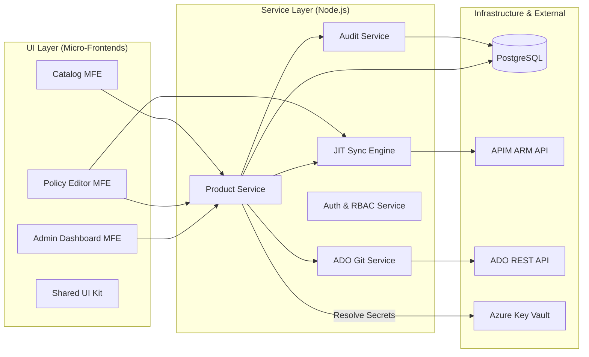
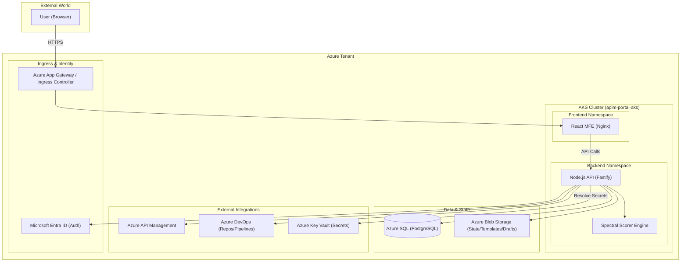
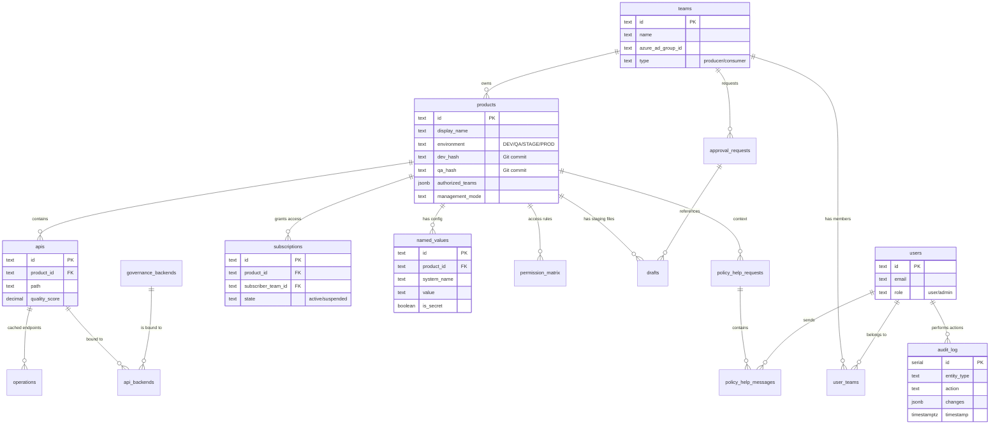
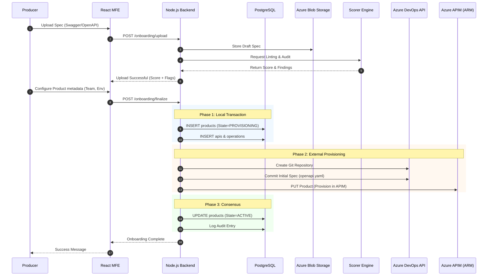
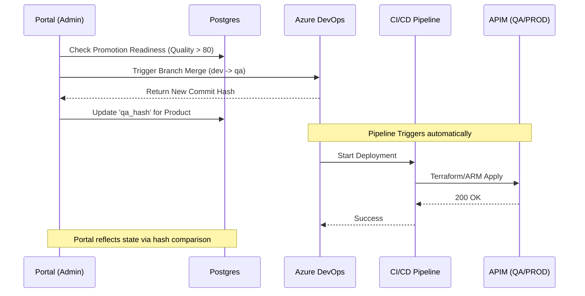

# Enterprise Architecture Diagrams

This document provides visual representations of the APIM Self-Service Portal's architecture, deployment model, data flows, and database schema.

---

## 🧩 1. System Component Architecture (C4 Component)
Modular breakdown of the system components and their interactions, highlighting the separation between UI, Service Layer, and Infrastructure.



---

## 🏗️ 2. Deployment Architecture (Azure AKS)
The system is designed for high availability and scalability using a containerized micro-frontend and micro-service architecture on **Azure Kubernetes Service (AKS)**.



---

## 📊 3. Database ER Diagram (Authoritative Model)
The following ERD captures the authoritative source of truth for the portal, showing relationships between teams, products, APIs, and governance resources.



---

## 🚀 4. Detailed Onboarding Saga (Sequence)
API Onboarding is a distributed transaction ("Saga") ensuring consistency across DB, Git, and Azure APIM.



---

## 🔄 5. Multi-Environment Promotion (GitOps)
Lifecycle of a change from DEV to PROD, leveraging Git as the single source of truth.



---

## 🧠 6. Scorer Engine Logic (Flow)
Internal decision-making process for evaluating API Quality and Security compliance.

```mermaid
flowchart TD
    Start([Receive API Spec]) --> Parse{Parse JSON/YAML}
    Parse -- Failure --> Err[Return Schema Error]
    Parse -- Success --> Spectral[Run Spectral Linter]
    
    Spectral --> Rules{Check Custom Rules}
    Rules --> Sec[Security Rules: OAuth/Scopes Check]
    Rules --> Std[Standard Rules: Versioning/Naming Check]
    
    Sec --> Calc[Calculate Weighted Quality Score]
    Std --> Calc
    
    Calc --> Threshold{Score > 75?}
    Threshold -- No --> Warn[Mark as 'Governance Warning']
    Threshold -- Yes --> Pass[Mark as 'Compliant']
    
    Pass --> End([Return Payload])
    Warn --> End

---

## 🎨 7. Policy Editor State Machine
The Policy Editor manages a complex state transition between Visual (Tile-based) and Code (Monaco) modes, ensuring bi-directional synchronization and data preservation.

```mermaid
stateDiagram-v2
    [*] --> Initializing
    Initializing --> FetchingData : Load XML from Repo
    FetchingData --> Parsing : Decompose XML
    
    state Parsing {
        [*] --> StructuralCheck
        StructuralCheck --> Valid : Schema Pass
        StructuralCheck --> Invalid : Schema Fail
    }

    Valid --> VisualMode : XML matched to Tiles
    Invalid --> CodeMode : Fallback (Unparseable)
    
    state VisualMode {
        [*] --> Idle
        Idle --> Dragging : User Interaction
        Dragging --> Dropped : Tile Modification
        Dropped --> SyncingCode : "Generate XML Chunk"
        SyncingCode --> Idle
    }

    state CodeMode {
        [*] --> CodeIdle
        CodeIdle --> Editing : Monaco Change
        Editing --> Debouncing : 500ms Delay
        Debouncing --> Validating : Spectral Lint
        Validating --> CodeIdle
    }

    VisualMode --> CodeMode : Switch to "View Code"
    CodeMode --> VisualMode : Switch to "Visual" (If Valid)

    VisualMode --> Saving : Click Save
    CodeMode --> Saving : Click Save
    Saving --> [*]
```
```
