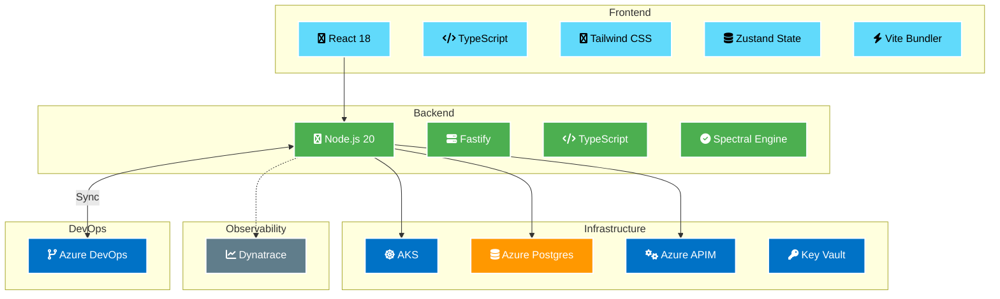
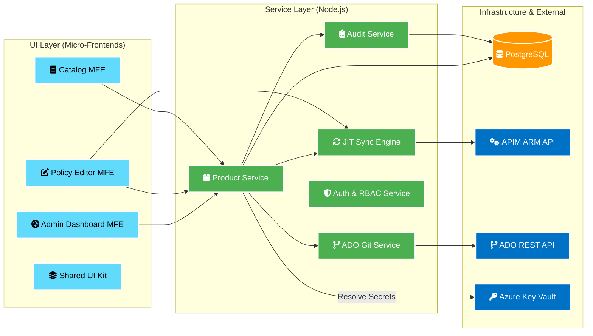
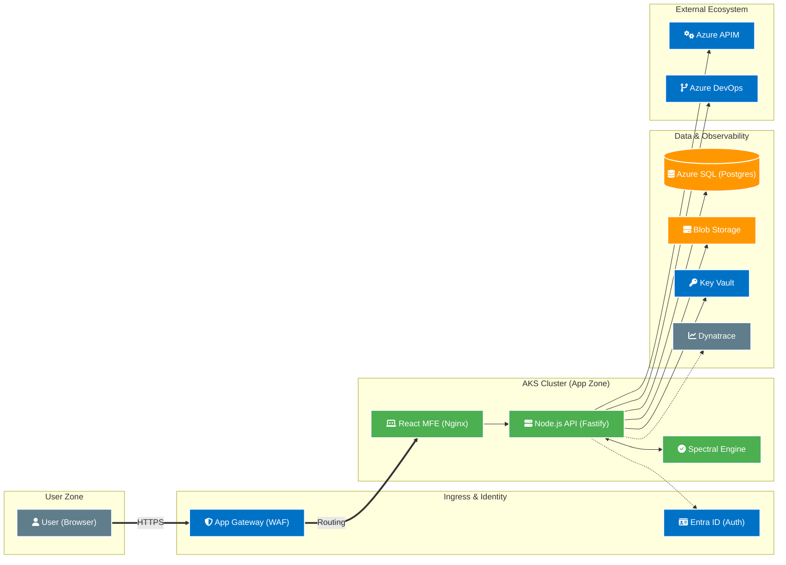
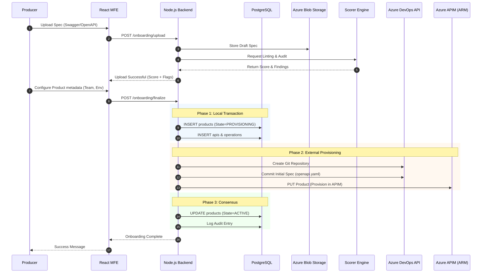
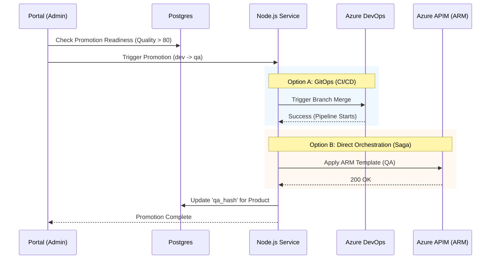
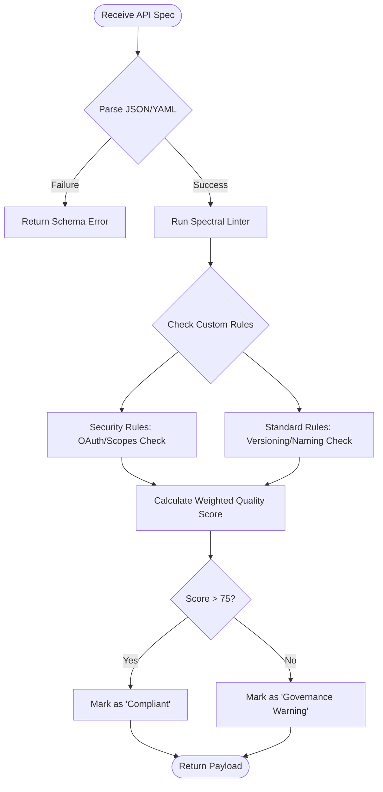
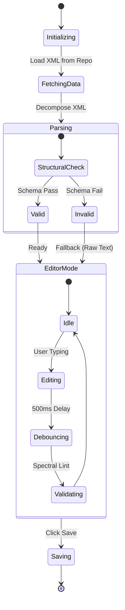

# Enterprise Architecture Diagrams

This document provides visual representations of the APIM Self-Service Portal's architecture, deployment model, data flows, and database schema.

---

## 🛠️ 0. Technology Stack Overview
High-level breakdown of the chosen technologies for each layer of the application.



---

## 🧩 1. System Component Architecture (C4 Component)
Modular breakdown of the system components and their interactions, highlighting the separation between UI, Service Layer, and Infrastructure.



---

## 🏗️ 2. Deployment Architecture (Azure AKS)
The system is designed for high availability and scalability using a containerized micro-frontend and micro-service architecture on **Azure Kubernetes Service (AKS)**.



---

## 📊 3. Database ER Diagram (Authoritative Model)
The following ERD captures the authoritative source of truth for the portal, showing relationships between teams, products, APIs, and governance resources.


---

## 🚀 4. Detailed Onboarding Saga (Sequence)
API Onboarding is a distributed transaction ("Saga") ensuring consistency across DB, Git, and Azure APIM.



---

## 🔄 5. Multi-Environment Promotion (Saga Pattern)
Lifecycle of a change from DEV to PROD. This can be orchestrated via an external CI/CD pipeline OR internally by the Node.js Service ("Saga" orchestrator) using ARM templates.



---

## 🧠 6. Scorer Engine Logic (Flow)
Internal decision-making process for evaluating API Quality and Security compliance.



---

## 🎨 7. Policy Editor State Machine
The Policy Editor manages the lifecycle of the XML policy document, ensuring structural integrity and compliance.


```
