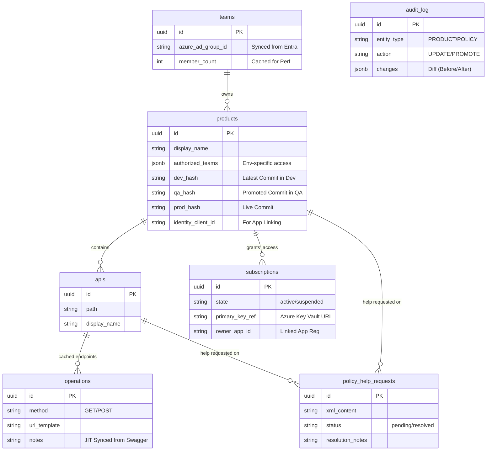
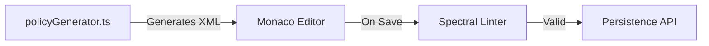
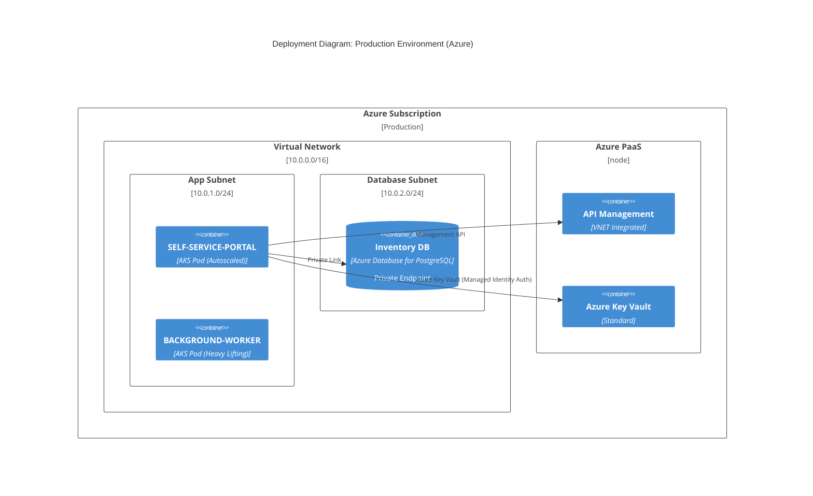

# Master Architecture Document (32-Day Sprint Edition)

## 1. Executive Summary
This document serves as the **Definitive Technical Reference** for the APIM Self-Service Portal. It captures the architecture of the system as implemented over the 30-day "Sprint 1", specifically focusing on the **"Reference Architecture"** pattern where internal storage is minimized in favor of referencing ADO and APIM as sources of truth.

---

## 2. Logical Data Model (ERD)
The system is backed by 11 core tables designed to track **Relationships** and **State**, not Content.

---

## 3. Scaling & Performance Strategy
How the system handles growth from 10 to 1 million operations.

### Frontend Scaling (Federation & Bundling)
The UI is not a monolith. It is designed for **Module Federation**.
*   **Decoupled Features:** The `PolicyStudio` and `Inventory` are built as isolated features with no direct internal dependencies.
*   **Scale Plan:** As the team grows, `src/features/policy-studio` can be extracted into a separate generic Git repository and published as `@internal/policy-studio`.
*   **Lazy Loading:** React `Suspense` is used to only load the heavy Monaco Editor when the user actually clicks "Edit XML".

### Backend Scaling (Statelessness & Async)
*   **Stateless API:** No session affinity is required. We can scale from 1 to 50 pods using **KEDA** based on CPU or Request Count triggers.
*   **Connection Pooling:** We use `pg-pool` to multiplex database connections, allowing thousands of concurrent requests to share a limited number of DB connections.
*   **Heavy Lifting Offload:**
    *   **Spec Parsing:** Handled by the generic `ParserService`. For very large specs (10MB+), this logic is designed to be moved to a dedicated **Background Worker Pod** in the AKS cluster, keeping the main API fast and responsive.

---

## 4. Reusability Strategy
We don't build "throwaway" code. Key components are designed for reuse across the enterprise.

### The Policy Intelligence Engine
The logic in `features/policy-studio/core` (XML Parsing, Validation) provides a generic "Two-Way Binding" between XML and JSON.
*   **Reuse:** This engine can be embedded into the IDE plugins (VS Code) or CI/CD pipelines to validate policies before they even reach the portal.

### The Spectral Analyzer
The backend validation logic (`/analyze`) wraps the open-source **Spectral** linter.
*   **Reuse:** The ruleset (`.spectral.yaml`) is shared. We can package this validation service as a CLI tool (`npm install -g @internal/api-linter`) so developers can run the exact same checks locally.

---

## 5. Security & Access Control
Deep defense layout using Zero Trust principles.

### Data Security (At Rest & In Transit)
*   **Azure Key Vault References:** We **NEVER** store actual API keys or Secrets in the PostgreSQL database. We store an **Azure Key Vault** Secret Identifier (`https://kv.azure.net/secrets/my-key`). The App authenticates via **Managed Identity** to resolve this only at runtime.
*   **TDE:** Azure PostgreSQL enforces Transparent Data Encryption.
*   **TLS 1.2+:** All internal traffic (App -> DB, App -> APIM) is encrypted.

### Access Control (RBAC & ABAC)
*   **Identity Source:** Entra ID is the only identity provider.
*   **Granularity:**
    *   **Team Level:** Access is granted to "Owners" via AD Group membership.
    *   **Scope Level:** A user who owns `Product A` cannot even *see* the generic "Edit" buttons for `Product B`.
    *   **OBO Flow:** The backend performs an "On-Behalf-Of" token exchange to ensure it only acts with the permissions of the calling user when talking to downstream Azure APIs.

---

## 6. Policy Studio Engine (Internal Architecture)
The Policy Studio is a **Hybrid Low-Code/Text Implementation**.

### Gap Analysis & Solution
*   **Problem:** "Visual editors break complex XML."
*   **Solution:** We implemented a `CustomBlock` preservation strategy. If the parser encounters an XML tag it doesn't recognize (e.g., a custom compiled logic), it wraps it in a "Raw Block" in the UI, ensuring no data loss on round-trip.

---

## 7. Deployment & Infrastructure View
Secure VNET topology.

