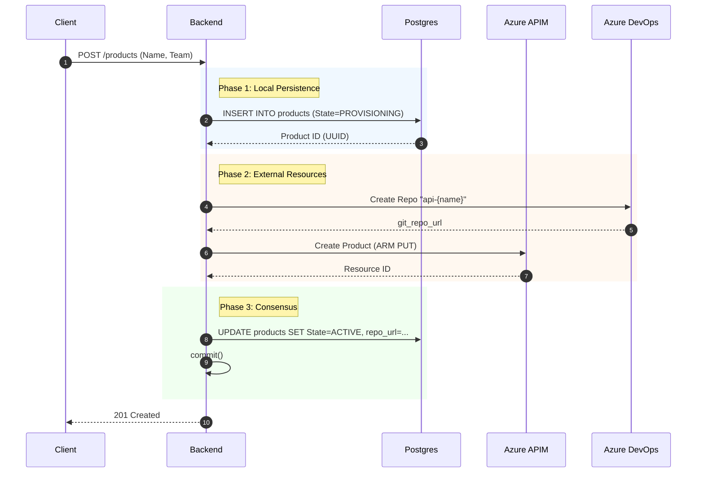
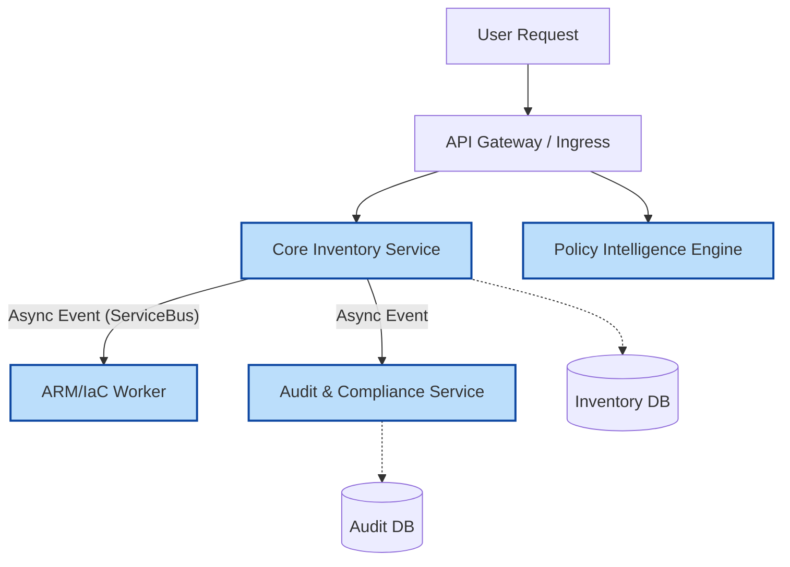
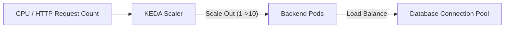
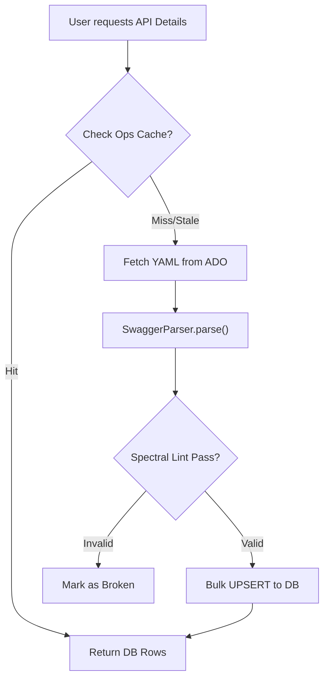
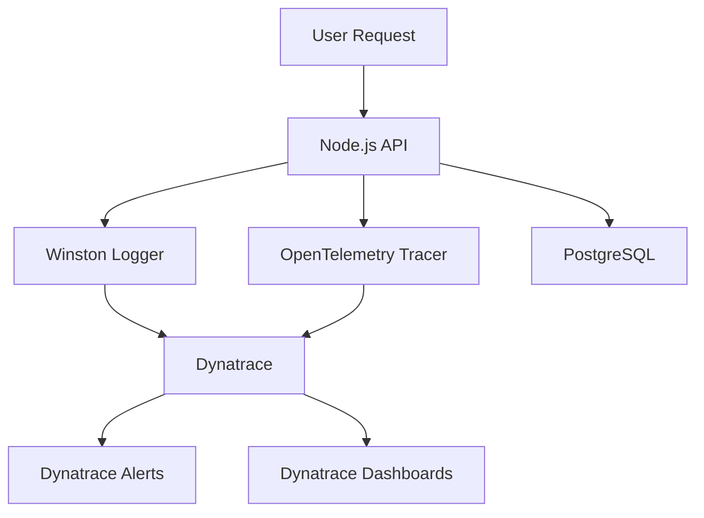
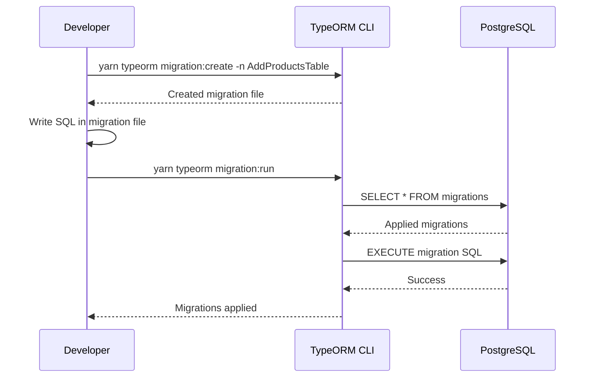

# Backend Engineer's Reference: Architecture & Scaling

## 1. Transactional Flow: The "Onboarding" SAGA
Creating a product is not a single DB insert. It is a distributed transaction across 3 systems. We manage this ensuring eventual consistency.

---

## 2. Microservices Architecture
The system is architected as a set of distributed **Microservices** to support scaling to **10 million daily API calls**.

### The Service Mesh

### Service Architecture

### Why & When to Split?
1.  **ARM Logic (`teams.service.ts`):** Azure operations are slow (2-3s). Moving this to a **Worker Queue** pattern allows the API to respond instantly.
2.  **Audit Logs:** High write volume. Dedicated ingestion service prevents blocking the main thread.

---

## 3. Horizontal Scaling & KEDA
How do we handle traffic spikes?

*   **Statelessness:** The backend stores NO session state (JWT only). This means we can scale from 1 replica to 50 instantly.
*   **Database Pooling:** We use `pg-pool` to ensure that 50 pods don't exhaust the Postgres connection limit (Max 100 connections).
*   **Async Processing:** Heavy jobs (Spec Parsing) are candidates for **Azure Functions** triggered by Event Grid, offloading CPU work from the main API.

---

## 4. JIT Sync Logic (Internal Flow)
The "Just-In-Time" sync is the most CPU-intensive operation.

---

## 5. Error Handling & Observability
We use a combination of structured logging, distributed tracing, and alerting.

*   **Structured Logging:** All logs are JSON formatted, allowing for easy querying in Dynatrace.
*   **Correlation IDs:** Every request gets a unique correlation ID, propagated through all downstream calls.
*   **Health Checks:** `/health` endpoint for liveness/readiness probes.

---

## 6. Database Migrations (TypeORM)
We use TypeORM for database migrations, ensuring schema evolution is managed.

