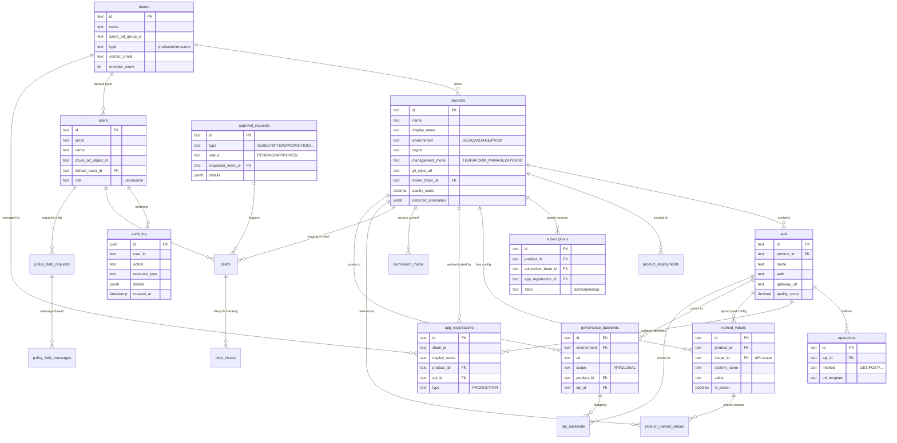

# Database Schema & ER Diagram

This document provides a detailed representation of the authoritative database schema used by the APIM Self-Service Portal.

---

## 📊 Entity Relationship Diagram (ERD)

The following diagram captures the relationships between core entities such as Teams, Products, APIs, and Governance logs.

---

## 📖 Data Dictionary

### Core Identity & Access
| Table | Column | Type | Description |
| :--- | :--- | :--- | :--- |
| **teams** | `id` | TEXT (PK) | Unique identifier for the team. |
| | `name` | TEXT | Human-readable name of the team. |
| | `azure_ad_group_id` | TEXT | Link to Entra ID (formerly Azure AD) group. |
| **users** | `id` | TEXT (PK) | Unique identifier for the user. |
| | `azure_ad_object_id`| TEXT | Link to Entra ID user object. |
| | `role` | TEXT | Portal role: `user` or `admin`. |
| **permission_matrix** | `product_id` | TEXT | The logical product the permission applies to. |
| | `ad_group_id` | TEXT | The Entra ID group granted access. |
| | `role` | TEXT | Role level: `Reader`, `Contributor`, `Owner`. |

### Inventory & Management
| Table | Column | Type | Description |
| :--- | :--- | :--- | :--- |
| **products** | `id` | TEXT (PK) | Unique identifier (e.g., `prod-inventory-dev`). |
| | `management_mode` | TEXT | `TERRAFORM_MANAGED`, `HYBRID`, or `UNTRACKED`. |
| | `identity_client_id` | TEXT | Primary App Registration bound to this product. |
| **apis** | `id` | TEXT (PK) | Unique identifier for the API implementation. |
| | `product_id` | TEXT (FK) | Parent product link. |
| | `path` | TEXT | Gateway relative path (e.g., `/api/v1/users`). |
| **operations** | `method` | TEXT | HTTP Verb (GET, POST, etc.). |
| | `url_template` | TEXT | REST path template for the operation. |

### Configuration & Connectivity
| Table | Column | Type | Description |
| :--- | :--- | :--- | :--- |
| **named_values** | `system_name` | TEXT | Variable name in APIM (e.g., `backend-url`). |
| | `value` | TEXT | Value or KeyVault reference. |
| | `scope_id` | TEXT (FK) | Optional link to a specific API for isolated config. |
| **governance_backends**| `url` | TEXT | The actual backend service URL. |
| | `scope` | TEXT | `API-level` or `GLOBAL` scope. |

### Lifecycle & Governance
| Table | Column | Type | Description |
| :--- | :--- | :--- | :--- |
| **subscriptions** | `state` | TEXT | Lifecycle state: `active`, `pending`, `expired`, etc. |
| | `app_registration_id`| TEXT (FK) | Link to the consumer's App Registration. |
| **approval_requests** | `type` | TEXT | Type of request (e.g., `PROMOTION_REQUEST`). |
| | `details` | JSONB | Payload containing the specific changes requested. |
| **audit_log** | `action` | TEXT | Action performed (e.g., `DELETE`, `READ_KEYS`). |
| | `resource_id` | TEXT | ID of the affected resource. |

---

> [!NOTE]
> This schema is synchronized with the PostgreSQL database. Any manual changes to the schema must be reflected here.
