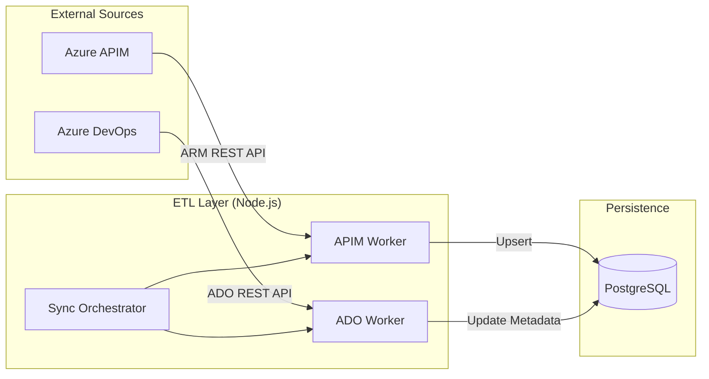

# ETL & Synchronization Strategy

The APIM Self-Service Portal maintains an authoritative "Digital Twin" of the enterprise API ecosystem by continuously synchronizing state from Azure APIM and Azure DevOps (ADO) into the Portal Database.

## 🔄 Core Sync Pipeline

The synchronization process is divided into specialized jobs that handle different aspects of the environment state.

### 1. APIM Inventory Sync (`sync-apim-to-db.ts`)
**Purpose:** Primary state synchronization from Azure APIM instances.
- **Orchestration:** Multi-process runner that forks workers per environment (DEV, QA, STAGE, PROD) for parallel execution.
- **Data Extracted:**
    - **Products:** Display names, descriptions, states, and XML policies.
    - **APIs & Operations:** Full path mapping, protocols, and backend service URLs.
    - **Subscriptions:** Active keys and owner mappings.
    - **Named Values:** Configuration constants and Key Vault references.
- **Logic:** Merges raw ARM metadata with "Governance Tags" (e.g., `TeamID`) to establish ownership in the portal.

### 2. ADO Metadata Extraction (`extract-ado-metadata.ts`)
**Purpose:** Linking API Products to their source repositories and CI/CD pipelines.
- **Discovery Engine:** Uses "Surgical Strikes" (targeted REST calls) to find repositories matching product names.
- **Deployment Tracking:**
    - Identifies the specific **Git Commit Hash** currently deployed in each environment.
    - Captures deployment metadata: Author, Message, Date, and Pipeline execution URL.
- **Spec Recovery:** Scans repositories for OpenAPI/Swagger specifications to ensure the Portal has the latest contract.

### 3. Governance Reconciliation (`reconcile-governance.ts`)
**Purpose:** Detection of "Drift" and "Orphans".
- Identifies resources in APIM that lack mandatory governance tags.
- Flags "Manual Creations" (resources in APIM not tracked by the Portal's GitOps flow).
- Generates compliance reports for platform admins.

### 4. Azure AD / Identity Sync
**Purpose:** Synchronizing enterprise team structures into the Portal.
- **Component:** `sync-apim-to-db.ts` (Integrated Logic) or `fetch-ad-groups.ts` (Utility).
- **Process:**
    - The Scheduled ETL Job authenticates as a Service Principal.
    - It queries **Microsoft Graph API** (`/memberOf` or `/groups`) to fetch AD Group memberships.
    - Upserts records into `teams` and `users` tables to establish the Portal's RBAC baseline.
- **Responsibility:** Initiated by the **Scheduled ETL Sync Pod** in AKS.

---

## 🛠️ Execution Model

The ETL jobs are designed to run in two modes:

1.  **Scheduled (Cron):** Full system reconciliation running **once a day** (configurable) as a Background Pod in the AKS Cluster.
2.  **Just-In-Time (JIT):** Triggered via Webhooks when a user performs an onboarding action in the Portal or pushes code to a managed repository.

---

## 🗺️ Roadmap: Sync Evolution

### Phase 3/4: Individual Resource Sync
In upcoming phases, the "All-or-Nothing" sync model will be enhanced with:
- **On-Demand Single Sync:** Button in the Admin/Product view to manually trigger a sync for a *specific* product ID.
- **Selective Table Sync:** Ability to refresh only "Named Values" or "Subscriptions" without a full inventory sweep.
- **Granular Error Handling:** If one environment (e.g., PROD) fails, the sync continues for others, reporting status per region.

---

## 📊 Data Flow Block Diagram

