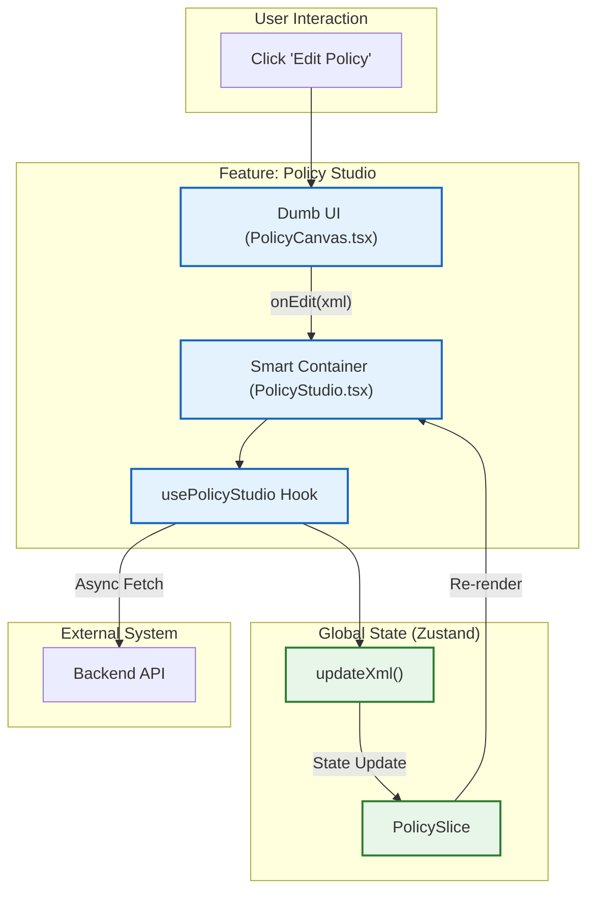
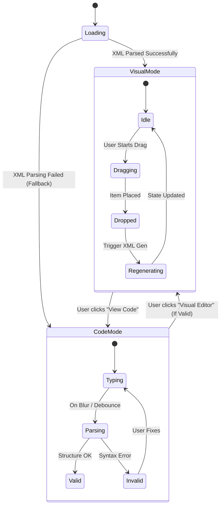
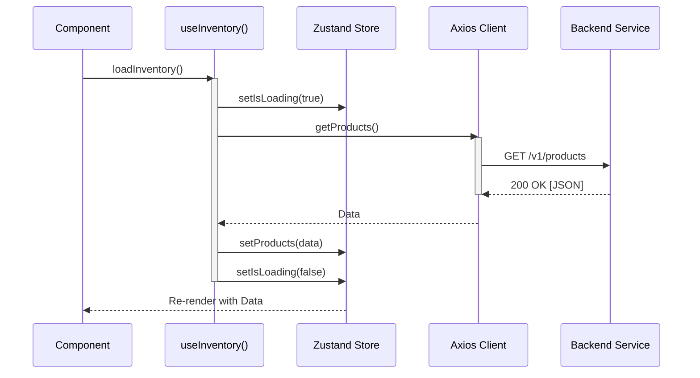

# Frontend Developer Guide: Architecture & Scaling

## 1. Visual Architecture Overview
The frontend is designed as a **Federated Host** application. It is not just a collection of pages, but a composition of autonomous feature modules.

---

## 2. Policy Studio: State Machine Diagram
The Policy Studio is a complex engine that transitions between "Visual" and "Code" states. Ensuring these states never drift is critical.

---

## 3. Data Flow Sequence: The "Hook Pattern"
We strictly enforce a unidirectional data flow. Components never talk to APIs directly.

---

## 4. Scaling The Frontend
How do we go from 5 developers to 50?

### Strategy 1: Federation (Module Splitting)
Currently, modules are imported statically. To scale, we can convert `src/features/*` into **Webpack Module Federation** remotes.
*   **Team A** owns `git/inventory-mfe` -> Deploys `inventory.js`.
*   **Team B** owns `git/policy-mfe` -> Deploys `policy.js`.
*   **App Host** consumes them at runtime.

### Strategy 2: State Isolation
We intentionally avoided a single `RootState` type exported from `store/index.ts` to prevent circular dependencies.
*   **Rule:** Feature A cannot import Feature B's slice directly.
*   **Communication:** Uses the `Global Event Bus` (or lightweight UI slice) for cross-feature signaling (e.g., "Toast Notification").

### Strategy 3: Component Library (Design System)
To maintain consistency at scale, `src/shared/ui` should be extracted to a private NPM package (`@company/ui-kit`).
*   **Before:** Import local button.
*   **After:** `import { Button } from '@company/ui-kit'`.
*   **Benefit:** Versioned breaking changes for UI.
