# Detailed User Flows & Sequence Diagrams

Comprehensive documentation of the specific interactions between users, the Portal Backend, and external systems (Azure APIM, ADO, DB).

---

## 👨‍💻 1. Producer Persona Flows
The Producer manages the lifecycle of their API Products.

### 1.1 API Product Onboarding (Discovery to Provisioning)
Covers the flow from initial spec upload to a fully provisioned environment in Azure, including identity enforcement.

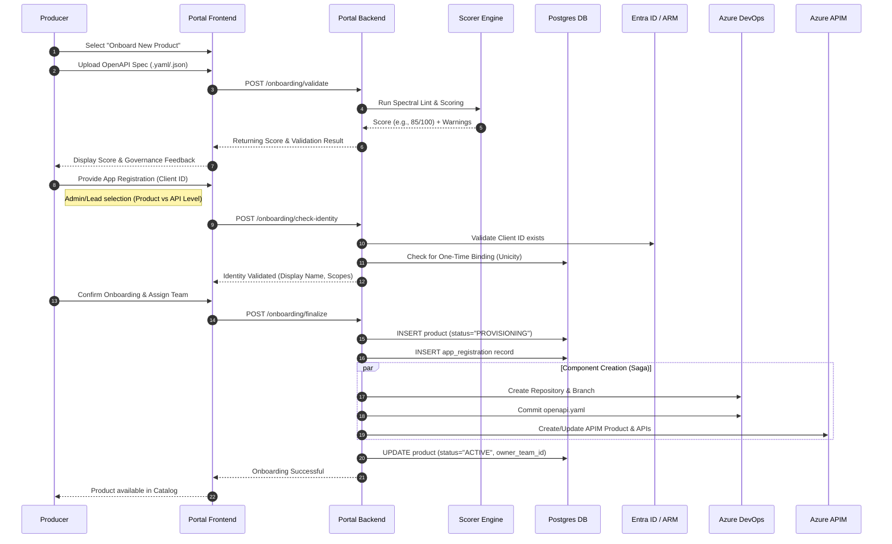

### 1.4 Governance Remediation (Fixing & Re-scoring)
The journey of a Producer resolving linting errors to improve their API Quality Score.

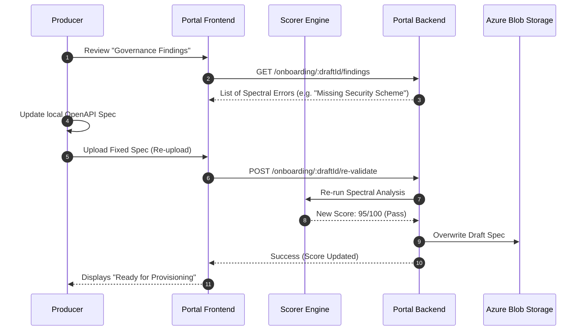

### 1.5 Patch Sync (Metadata Update)
Updating product-level metadata (Tags, Descriptions, Visibility) without full resource re-provisioning.

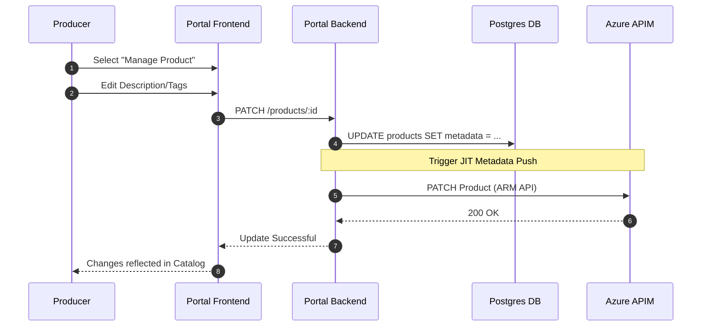

### 1.2 Onboarding Saga: Compensation (Rollback) Flow
Detailed flow showing how the system handles failures during the multi-system provisioning process.

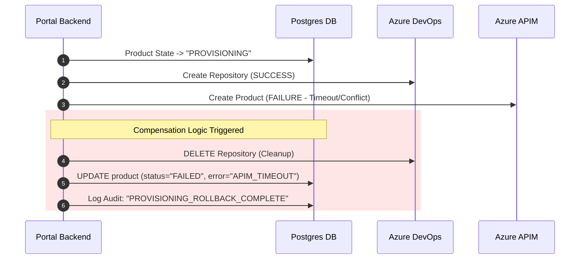

### 1.3 Identity Inheritance (Existing Product Onboarding)
Flow for adding a new API to an existing Product while inheriting its security identity.

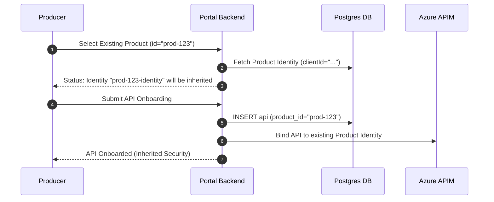

### 1.2 Environment Promotion (STAGE Approval Flow)
Detailed flow showing the **Producer Lead** approval logic and technical execution options.

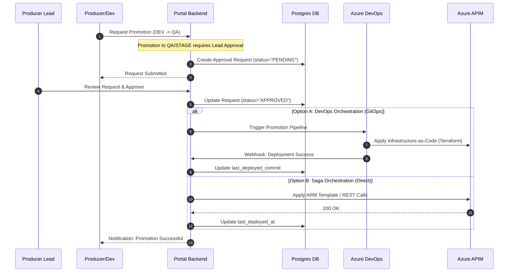

---

## 👔 2. Producer Lead Persona Flows
The Producer Lead (Team Lead/Manager) provides oversight and authority for team-level changes.

### 2.1 Approval Queue Management
The journey of a Lead reviewing and acting upon pending promotion or subscription requests.

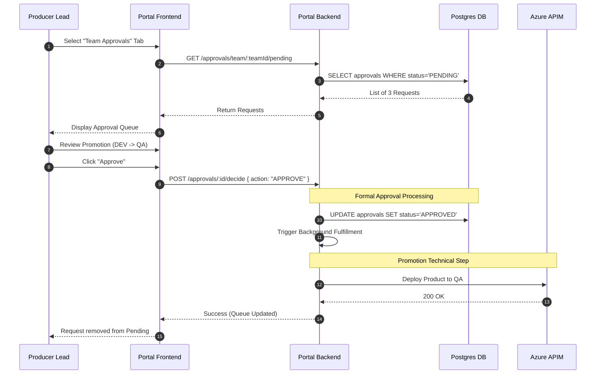

### 2.2 Team Quality Metrics Oversight
How a Lead monitors the governance and scoring health across their team's entire API portfolio.

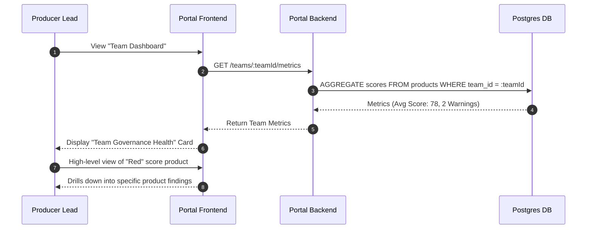

---

## 👥 3. Consumer Persona Flows
The Consumer discovers and integrates with available APIs.

### 3.1 Product Discovery & Documentation
How consumers find APIs and understand their technical interface before requesting access.

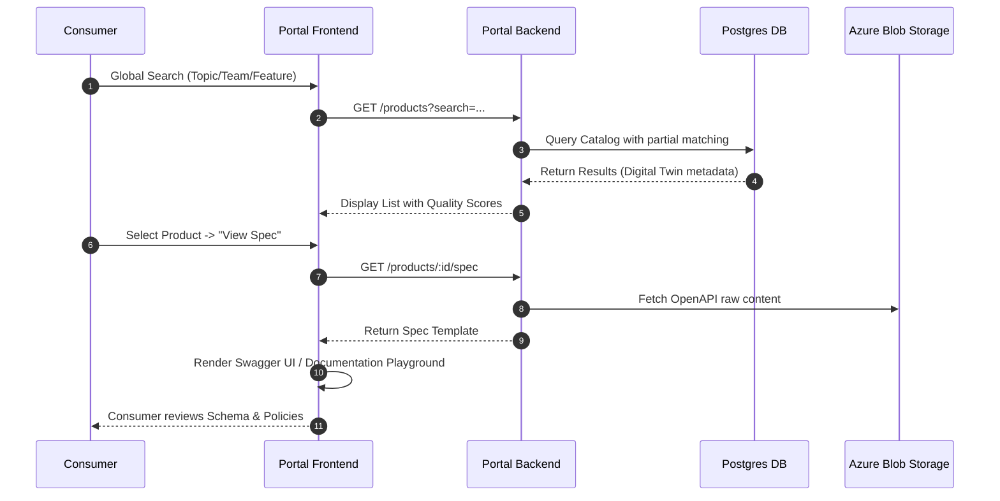

### 3.2 Subscription & Access Procurement (Lead Approval)
The flow of requesting access, specifically highlighting the requirement for approval by the **Producing Team Lead**.

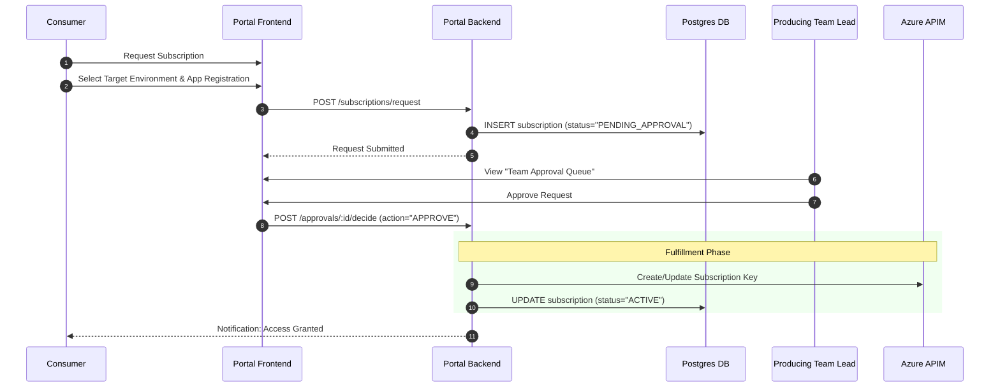

### 3.3 Documentation Consumption & Playground
How consumers interact with API metadata, Swagger UI, and policy documentation to understand integration requirements.

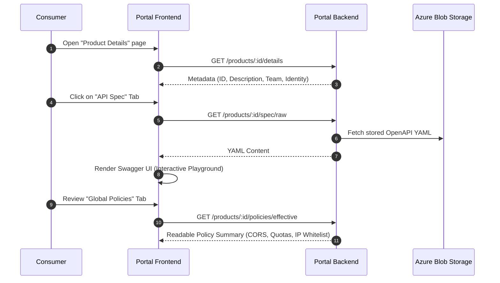

---

## 🛡️ 4. Admin Persona Flows
The Platform Admin ensures system health, compliance, and handles infrastructure drift.

### 4.1 Governance & Orphan Management
How the portal identifies resources in Azure/ADO that are not tracked in the database ("Orphans") and reconciles them.

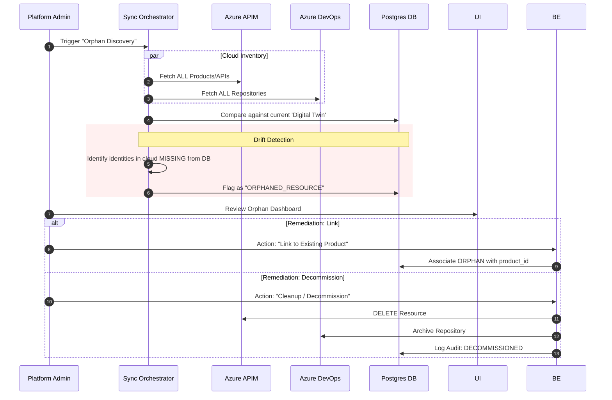

### 4.2 Manual ETL Sync (Force-Reconcile)
Triggering a full system-wide synchronization between Azure/ADO and the Portal DB outside the scheduled window.

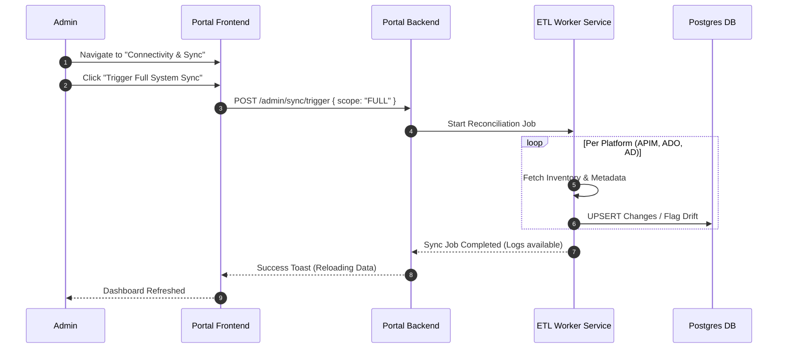

### 4.3 Global Template Management
Updating the enterprise-wide policy and metadata templates that new APIs use during onboarding.

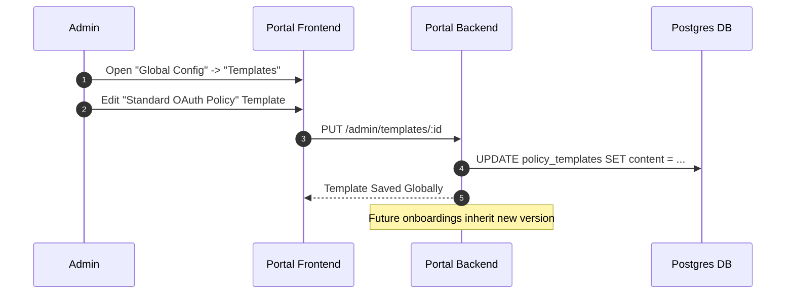

---

## 🔐 5. Entity-Specific Granular Flows

### 5.1 Team Synchronization (AD Group Integration)
How teams are established from enterprise directory groups.

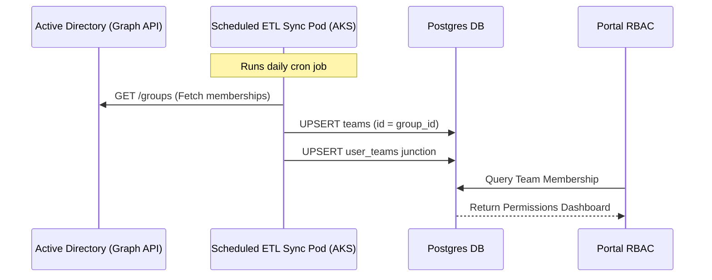

### 5.2 API Key Rotation (Self-Service)
The process of rolling credentials without downtime.

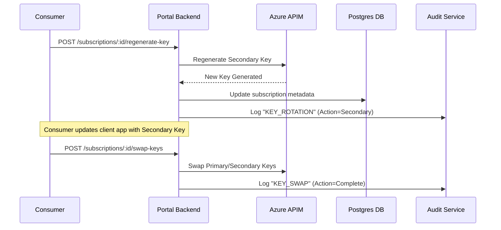

### 5.3 Approval Request Lifecycle
Granular state transitions from submission to implementation.

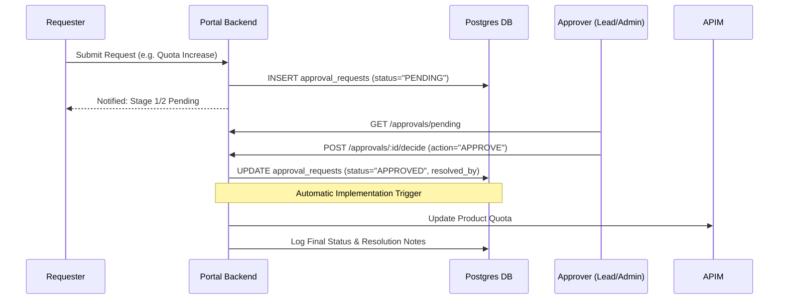

### 5.4 Connectivity Matrix Diagnostics
How the portal verifies network-level connectivity between the Gateway and Backend API endpoints.

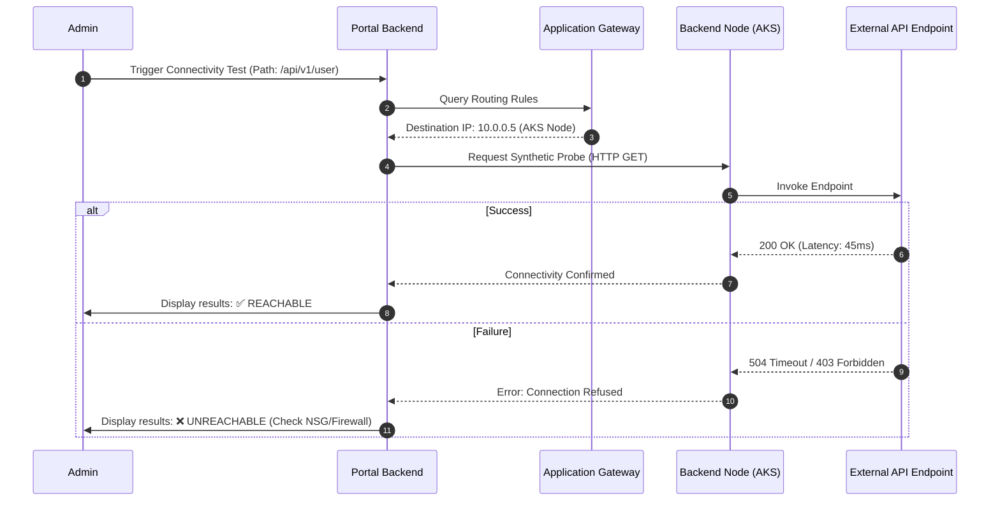

### 5.5 Resource Decommissioning (Admin Flow)
The end-of-life journey for a Product or API resource.

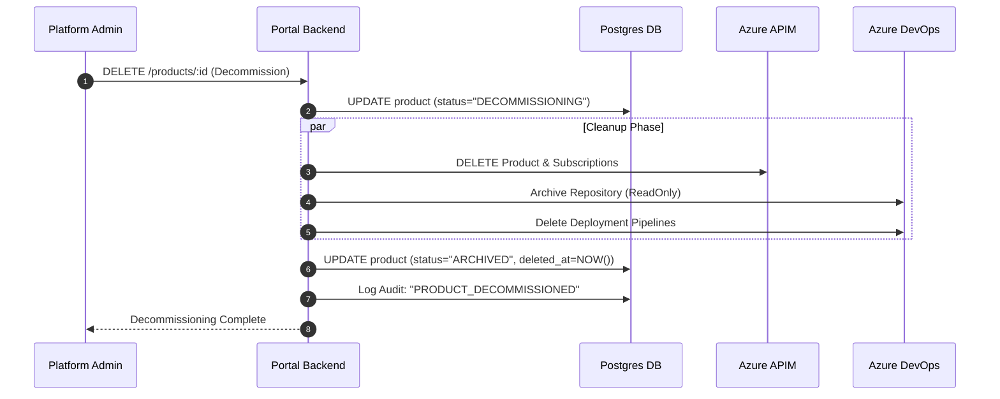

